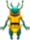

# Shooter Game!

A simple 2D shooting game made using Python and Pygame. The player controls a fighter ship that can move left and right and shoot bullets to destroy falling aliens.

## 🎮 Overview

- The player controls a fighter at the bottom of the screen.
- Press the left/right arrow keys to move and the spacebar to shoot.
- Aliens descend from the top of the screen.
- Shoot aliens to score points before they reach your fighter.
- Game ends when an alien touches the fighter.

## 📦 Features

- Basic 2D game mechanics using `pygame`
- Collision detection between bullet and alien
- Progressive difficulty (aliens move faster over time)
- Score tracking and game over screen

## 🖥️ Screenshots

| Alien |     | Fighter |     | Ball |
|-------|-----|---------|-----|------|
|  | |  | |  |


## 🚀 Installation

1. **Clone the repository**
   ```bash
   git clone https://github.com/yourusername/shooter-game.git
   cd shooter-game
   ```


2. **Install dependencies**
   Make sure you have Python 3 and `pygame` installed.

   ```bash
   pip install pygame
   ```

3. **Add required assets**
   Place the following images in a folder named `images/`:

   * `fighter.png`
   * `ball.png`
   * `alien.png`

4. **Run the game**

   ```bash
   python game.py
   ```

## 🎮 Controls

| Key         | Action       |
| ----------- | ------------ |
| Left Arrow  | Move Left    |
| Right Arrow | Move Right   |
| Spacebar    | Shoot Bullet |

## 📁 Project Structure

```
shooter-game/
│
├── images/
│   ├── fighter.png
│   ├── ball.png
│   └── alien.png
├── game.py
└── README.md
```

## 🤝 Contributing

Contributions, suggestions, and improvements are welcome! To contribute:

1. Fork the repository
2. Create a new branch: `git checkout -b feature-name`
3. Commit your changes: `git commit -m 'Add feature'`
4. Push to the branch: `git push origin feature-name`
5. Create a pull request

## 📝 License

This project is licensed under the MIT License. See the `LICENSE` file for more details.

---

**Happy Shooting! 👾**
